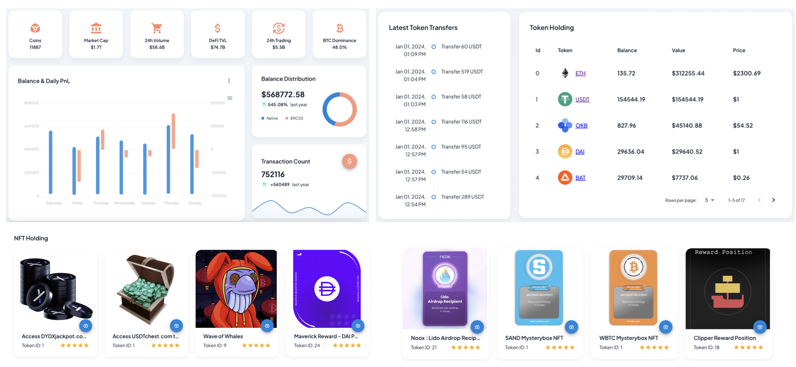

<!-- Improved compatibility of back to top link: See: https://github.com/othneildrew/Best-README-Template/pull/73 -->
<a name="readme-top"></a>
<!--
*** Thanks for checking out the Best-README-Template. If you have a suggestion
*** that would make this better, please fork the repo and create a pull request
*** or simply open an issue with the tag "enhancement".
*** Don't forget to give the project a star!
*** Thanks again! Now go create something AMAZING! :D
-->


<!-- PROJECT SHIELDS -->
<!--
*** I'm using markdown "reference style" links for readability.
*** Reference links are enclosed in brackets [ ] instead of parentheses ( ).
*** See the bottom of this document for the declaration of the reference variables
*** for contributors-url, forks-url, etc. This is an optional, concise syntax you may use.
*** https://www.markdownguide.org/basic-syntax/#reference-style-links
-->
<!-- [![Contributors][contributors-shield]][contributors-url]
[![Forks][forks-shield]][forks-url]
[![Stargazers][stars-shield]][stars-url]
[![Issues][issues-shield]][issues-url]
[![MIT License][license-shield]][license-url]
[![LinkedIn][linkedin-shield]][linkedin-url] -->


<!-- PROJECT LOGO -->
<br />
<div align="center">
  <a href="https://github.com/tqdpham96/portfolio-management-be">
    
  </a>

<h3 align="center">Web3 Portfolio Management Backend NestJS</h3>

  <p align="center">
    The Backend code for my Medium article of "Let's Build a Web3 Portfolio Management Together: Part II - Back-end Development". This series go into the creation of a Web3 Portfolio Management system from sratch (UI, backend, frontend, blockchain API, cloud deployment). Please find the article link in the end if you find it useful.

    <br />
    <a href="https://crypto-portfolio-management-tqdpham.netlify.app/">View Demo</a>
    ·
    <a href="https://github.com/tqdpham96/portfolio-management-be/issues">Report Bug</a>
    ·
    <a href="https://github.com/tqdpham96/portfolio-management-be/issues">Request Feature</a>
  </p>
</div>


<!-- TABLE OF CONTENTS -->
<details>
  <summary>Table of Contents</summary>
  <ol>
    <li>
      <a href="#about-the-project">About The Project</a>
      <ul>
        <li><a href="#built-with">Built With</a></li>
      </ul>
    </li>
    <li>
      <a href="#getting-started">Getting Started</a>
      <ul>
        <li><a href="#prerequisites">Prerequisites</a></li>
        <li><a href="#installation">Installation</a></li>
         <li><a href="#runningtheapp">Running the app</a></li>
          <li><a href="#test">Test</a></li>
      </ul>
    </li>
    <li><a href="#usage">Usage</a></li>
    <li><a href="#roadmap">Roadmap</a></li>
    <li><a href="#contributing">Contributing</a></li>
    <li><a href="#license">License</a></li>
    <li><a href="#contact">Contact</a></li>
    <li><a href="#acknowledgments">Acknowledgments</a></li>
  </ol>
</details>


<!-- ABOUT THE PROJECT -->
## About The Project


Hello, fellow builders! In Part I, we explored the foundational concepts and the vision of our Web3 Portfolio Management system. Now, it's time to roll up our sleeves and dive into the heart of the matter - backend development.
If you missed the overview and want to catch up, don't worry! You can find Part I here. 
https://medium.com/p/6233bd972fe7

Now, let's continue our coding journey and bring our Web3 portfolio to life by API and Cloud Deployment. Ready? Let's get started!
<p align="right">(<a href="#readme-top">back to top</a>)</p>


### Built With

* NestJS
* Ankr
* Web3js
* TypeScript

<p align="right">(<a href="#readme-top">back to top</a>)</p>


<!-- GETTING STARTED -->
## Getting Started

Lets get started!!!

### Prerequisites

Install the requirement libraries and NestJS framework
  ```sh
  $ npm i @nestjs/cli
  ```

### Installation

1. Clone the repo
   ```sh
   $ git clone https://github.com/tqdpham96/portfolio-management-be.git
   ```

2. Install packages
   ```sh
   $ npm install
   ```

3. Define .env variable (see the article for more information)

<p align="right">(<a href="#readme-top">back to top</a>)</p>

### Running the app

   ```sh
    # development
    $ npm run start

    # watch mode
    $ npm run start:dev

    # production mode
    $ npm run start:prod
   ```

### Test

   ```sh
    # unit tests
    $ npm run test

    # e2e tests
    $ npm run test:e2e

    # test coverage
    $ npm run test:cov
   ```

<!-- USAGE EXAMPLES -->
## Usage

* GET /api/v1/portfolio/market-summary // For Market Summary
https://api-asset-management-tqdpham.cyclic.app/market-summary

* GET /api/v1/portfolio/history // For Balance Chart
https://api-asset-management-tqdpham.cyclic.app/history

* GET /api/v1/portfolio/balance  // For Balance Distribution
https://api-asset-management-tqdpham.cyclic.app/balance

* GET /api/v1/portfolio/transaction // For Transaction Count
https://api-asset-management-tqdpham.cyclic.app/transaction

* GET /api/v1/portfolio/token-transfers // For Token Transfers
https://api-asset-management-tqdpham.cyclic.app/token-transfers

* GET /api/v1/portfolio/token-holding // For Token Holding Table
https://api-asset-management-tqdpham.cyclic.app/token-holding

* GET /api/v1/portfolio/nft-holding // For NFT Holding
https://api-asset-management-tqdpham.cyclic.app/nft-holding

<p align="right">(<a href="#readme-top">back to top</a>)</p>


<!-- ROADMAP -->
## Roadmap

- [ ] Add MongoDB Database
- [ ] Add Cronjob for data crawling
- [ ] Add Additional Feature if needed, i.e., query with wallet address and chain id
- [ ] Multi-language Support
    - [ ] French
    - [ ] Germany

See the [open issues](https://github.com/tqdpham96/portfolio-management-be/issues) for a full list of proposed features (and known issues).

<p align="right">(<a href="#readme-top">back to top</a>)</p>


<!-- CONTRIBUTING -->
## Contributing

Contributions are what make the open source community such an amazing place to learn, inspire, and create. Any contributions you make are **greatly appreciated**.

If you have a suggestion that would make this better, please fork the repo and create a pull request. You can also simply open an issue with the tag "enhancement".
Don't forget to give the project a star! Thanks again!

1. Fork the Project
2. Create your Feature Branch (`git checkout -b feature/AmazingFeature`)
3. Commit your Changes (`git commit -m 'Add some AmazingFeature'`)
4. Push to the Branch (`git push origin feature/AmazingFeature`)
5. Open a Pull Request

<p align="right">(<a href="#readme-top">back to top</a>)</p>


<!-- LICENSE -->
## License

Distributed under the MIT License. See `LICENSE.txt` for more information.

<p align="right">(<a href="#readme-top">back to top</a>)</p>


<!-- CONTACT -->
## Contact

Dr. T.Q.D. Pham -  pqducthinhbka@gmail.com

Project Link: [https://crypto-portfolio-management-tqdpham.netlify.app/](https://crypto-portfolio-management-tqdpham.netlify.app/)

Medium Article: [https://medium.com/@pqducthinhbka/lets-build-a-web3-portfolio-management-together-part-ii-back-end-development-c3b68c54444c](https://medium.com/@pqducthinhbka/lets-build-a-web3-portfolio-management-together-part-ii-back-end-development-c3b68c54444c)

<p align="right">(<a href="#readme-top">back to top</a>)</p>


<!-- ACKNOWLEDGMENTS -->
## Acknowledgments

* [NestJS](https://nestjs.com/)
* [Ankr](https://www.ankr.com/)
* [Web3js](https://web3js.readthedocs.io/en/v1.10.0/)

<p align="right">(<a href="#readme-top">back to top</a>)</p>


<!-- MARKDOWN LINKS & IMAGES -->
<!-- https://www.markdownguide.org/basic-syntax/#reference-style-links -->
[contributors-shield]: https://img.shields.io/github/contributors/github_username/repo_name.svg?style=for-the-badge
[contributors-url]: https://github.com/github_username/repo_name/graphs/contributors
[forks-shield]: https://img.shields.io/github/forks/github_username/repo_name.svg?style=for-the-badge
[forks-url]: https://github.com/github_username/repo_name/network/members
[stars-shield]: https://img.shields.io/github/stars/github_username/repo_name.svg?style=for-the-badge
[stars-url]: https://github.com/github_username/repo_name/stargazers
[issues-shield]: https://img.shields.io/github/issues/github_username/repo_name.svg?style=for-the-badge
[issues-url]: https://github.com/github_username/repo_name/issues
[license-shield]: https://img.shields.io/github/license/github_username/repo_name.svg?style=for-the-badge
[license-url]: https://github.com/github_username/repo_name/blob/master/LICENSE.txt
[linkedin-shield]: https://img.shields.io/badge/-LinkedIn-black.svg?style=for-the-badge&logo=linkedin&colorB=555
[linkedin-url]: https://linkedin.com/in/linkedin_username
[product-screenshot]: images/preview.png
[Python]: https://www.python.org/static/img/python-logo@2x.png
[Python-url]: https://www.python.org/
[Streamlit]: https://streamlit.io/images/brand/streamlit-mark-color.svg
[Streamlit-url]: https://streamlit.io/
[Heroku]: https://encrypted-tbn0.gstatic.com/images?q=tbn:ANd9GcRitRYJmyZ3IrHw5Pryim_gGQdOZITn90g-Wvd9F87RehP9Tw3An_mFKE9OqtA1kJXQ_A&usqp=CAU
[Heroku-url]: https://heroku.com/
[OpenAI]: https://encrypted-tbn0.gstatic.com/images?q=tbn:ANd9GcTCX5oU1OHZxG4Hws6jr2brvyQuwDZGJ9ixaAKojBcAag&s
[OpenAI-url]: https://openai.com/